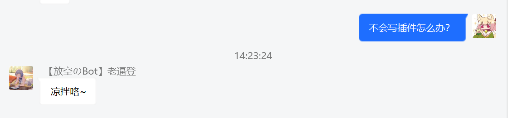
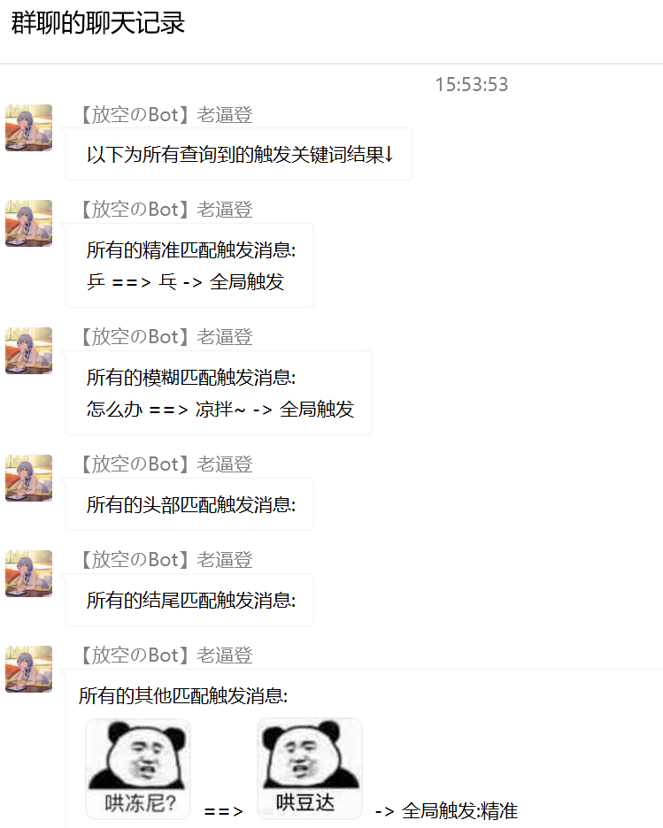

# HuYanSession 壶言会话
    基于的mirai-console的插件

[Release](https://github.com/Moyuyanli/GroupSession/releases/tag/formal)
[MiraiForum](https://mirai.mamoe.net/topic/1310/%E5%A3%B6%E8%A8%80-%E4%B8%80%E6%AC%BE%E8%87%AA%E5%AE%9A%E4%B9%89%E6%B6%88%E6%81%AF%E5%9B%9E%E5%A4%8D%E6%8F%92%E4%BB%B6)

### 使用

丢进plugin文件夹中运行console就行
运行一次之后停掉console，到config里面设置一下主人和指定机器人

### 基本功能
    
简单的根据关键内容进行特定的内容回复，能够识别作用域(指定群)

#### 学习指令
根据关键词进行回复，这个大部分插件都有，就不演示了(支持图片)。
    
    学习指令的基本格
    学习 (触发内容) (回复内容) [精准|模糊|头部|结尾] [当前|全局]
    学习 啊 吧

后面两个参数是可选，不带就是默认第一个

#### 学习的其他功能

可以指定关键词匹配方式，以及作用域范围

例如 ：

当你学习了一个模糊匹配的关键词
    
    学习 怎么办 凉拌咯~ 模糊

在遇见消息内包含怎么办就会触发
    

其他匹配机制同理

在匹配机制后面，还有一个可选参数，作用域，这个代表的是只在本群触发还是所有群触发。
如果不填，默认只在本群触发，要添加全局的话只能是主人才能添加！

#### 查询和删除

由于两个指令结构一样，一次写完

    查询 [关键内容]
    删除 [关键内容]

### 权限操作

在这个插件中，我自己写了一套权限识别。很简单的

上面的3个基本指令都需要权限才能操作，主人拥有全部权限。

当然，既然设定了权限系统，就肯定能外放权限(让群友自由发挥,就会见识到神奇的天地)。

操作指令
    
    +@某人 (session|admin|group)
    -@某人 (session|admin|group)

*图方便，不支持自定义输入qq号来添加权限，仅支持群内@某人*

session 会话权限 也就是学习 删除 查询 3大指令的使用权
admin 管理权限 可以操作权限的人，意思他也可以操作别人的权限(只有这个权限的话也是用不了会话仨指令的,虽然能给自己加就是)
group 群管理权限 还在设计中，目前没有任何用处，以后估计可能能用来禁言吧。

### 其他操作

由于刚进社区就接触了个[斗地主插件](https://mirai.mamoe.net/topic/626/%E6%96%97%E5%9C%B0%E4%B8%BB-%E4%B8%80%E4%B8%AA%E5%9C%A8qq%E7%BE%A4%E5%86%85%E6%96%97%E5%9C%B0%E4%B8%BB%E7%9A%84%E6%8F%92%E4%BB%B6-%E6%9C%89%E7%BC%96%E8%AF%91),所以玩了好久。
甚至后来拿到源码根据自身的需求进行了一番修改，然后继续用着，但是没有帮助，就顺手在本插件里面写了一个改过后的斗地主插件的帮助...
发送斗地主就可

    斗地主

还有个本插件的帮助，目前还没写，有空再写

有个对喷回复
    
    噗~

有几个小指令，只有console的主人才有权限使用

    /m pu 对喷
    /m p 为自己添加所有权限(没用了，已经可以设置主人了)
    /m power <s> <qq> <power> 根据qq号进行权限更改，第一个参数就是+或者-

### 已知BUG和规划

-bug:目前发现学习图片在手机无法实现，这个有空再改
-规划:后续的跟群管理相关的指令

### 意见与反馈

如果你有更好的意见或者发现了某个bug，欢迎在下方评论

### 推荐

进了一个[Mirai的交流群](https://mirai.mamoe.net/topic/1293/%E6%88%91%E5%BB%BA%E4%BA%86%E4%B8%80%E4%B8%AAmirai%E7%9A%84qq%E7%BE%A4-%E9%9D%9E%E5%AE%98%E6%96%B9)
欢迎大家也进来玩啊~
    
    